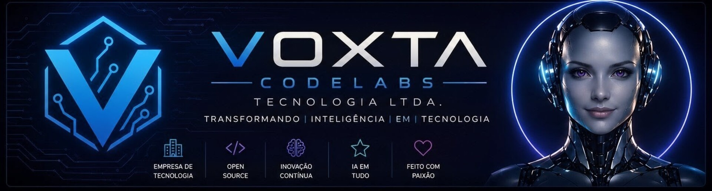

<div align="center">



# 🚀 Voxta CodeLabs Tecnologia Ltda.

### **Transformando Inteligência em Tecnologia**

<p>


</p>

</div>

---

# 👋 Bem-vindo à Voxta CodeLabs

A **Voxta CodeLabs Tecnologia Ltda.** é um laboratório de tecnologia especializado em **Inteligência Artificial**, **Engenharia de Software**, **Ciência de Dados**, **Cloud Computing**, **Automação** e **Plataformas Inteligentes**.

Nosso propósito é desenvolver soluções escaláveis que unem inovação, inteligência e engenharia para acelerar negócios e transformar ideias em produtos digitais de alto impacto.

---

# 🤖 Conheça a Voxta AI

<p align="center">


</p>

> Olá!
>
> Eu sou a **Voxta AI**, a inteligência artificial oficial da Voxta CodeLabs.
>
> Estou aqui para apoiar o desenvolvimento de soluções inovadoras, compartilhar conhecimento e impulsionar projetos utilizando Inteligência Artificial, Engenharia de Software, Dados e Automação.

---

# 🌎 Nossa Missão

Desenvolver tecnologias inteligentes capazes de transformar pessoas, empresas e mercados por meio da inovação contínua.

---

# 🎯 Nossa Visão

Ser uma referência nacional e internacional em desenvolvimento de soluções baseadas em Inteligência Artificial.

---

# 💙 Nossos Valores

- 🚀 Inovação
- 💡 Criatividade
- 🤝 Ética
- 📚 Compartilhamento de Conhecimento
- 🌎 Tecnologia Humanizada
- 📈 Evolução Contínua

---

# 🧠 Áreas de Atuação

| Área | Especialidades |
|------|----------------|
| 🤖 Inteligência Artificial | IA Generativa • LLMs • Agentes Inteligentes |
| 💻 Engenharia de Software | APIs • Microsserviços • Arquitetura |
| ☁ Cloud Computing | AWS • Azure • GCP |
| 📊 Dados & Analytics | BI • Engenharia de Dados • Dashboards |
| ⚙ Automação | RPA • Bots • Integrações |
| 🔐 Cyber Security | DevSecOps • LGPD • Segurança |
| 🚀 Plataforma | DevOps • CI/CD • Kubernetes |

---

# 💻 Stack Tecnológica

### Linguagens


---

### Frameworks

Python • FastAPI • Node.js • LangChain • TensorFlow • PyTorch • Scikit-Learn

---

### Banco de Dados

PostgreSQL • MySQL • MongoDB

---

### Cloud

AWS • Azure • Google Cloud Platform

---

### DevOps

Docker • Kubernetes • Git • GitHub Actions • Linux

---

# 📌 Projetos

Em nossos repositórios você encontrará projetos relacionados a:

- Inteligência Artificial
- Engenharia de Dados
- Ciência de Dados
- Engenharia de Plataforma
- Cloud
- Machine Learning
- Automação
- Frameworks Proprietários
- Open Source

---

# 📈 Estatísticas

> Configure substituindo **SEU_USUARIO** pelo usuário oficial da organização.

<p align="center">


</p>

---

# 🛣 Roadmap

- ✅ Estruturação institucional
- 🚧 Framework proprietário
- 🚧 Plataforma de IA
- 🚧 Biblioteca Open Source
- 🚧 Portal de Documentação
- 🚧 Academia Voxta
- 🚧 Marketplace de Soluções

---

# 🌐 Nossa Filosofia

> **Não desenvolvemos apenas software.**
>
> Construímos tecnologia para transformar negócios, acelerar pessoas e impulsionar a inovação.

---

# 📂 Estrutura do Repositório

```text
.
├── docs/
│   └── assets/
│       ├── avatar/
│       ├── banner/
│       └── logo/
├── src/
├── README.md
├── LICENSE
├── CONTRIBUTING.md
├── SECURITY.md
└── CODE_OF_CONDUCT.md
```

---

# 📬 Contato

📧 contato@voxtacodelabs.com

🌐 https://voxtacodelabs.com

💼 LinkedIn *(Em breve)*

📺 YouTube *(Em breve)*

---

<div align="center">


## **Voxta CodeLabs Tecnologia Ltda.**

### **Transformando Inteligência em Tecnologia**

**Engineering the Future with Artificial Intelligence**

---

⭐ **Se este projeto foi útil, deixe uma estrela e acompanhe nossa evolução!**

</div>
